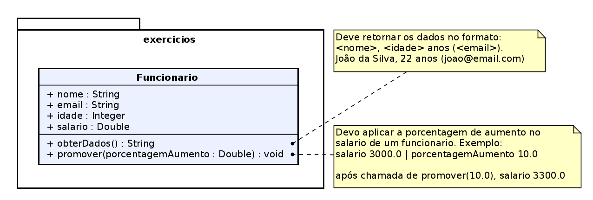

# Lista de Exercícios 01

As classes devem ser criadas nos diretórios/pacote:
 - classes: `/src/main/java/exercicios`
 - testes: `/src/test/java/exercicios`
 
### Exercício 01 - Figuras geométricas Retângulo e Círculo
Utilize as classes `Quadrado` e `QuadradoTeste` apresentadas nos exemplos como referências.

1. Implementar em java as classes `Retangulo` e `Circulo` com os métodos `area` e `perimetro`. Identifique os atributos necessários de cada classe. 
1. Criar as classes de teste `RetanguloTeste`, `CirculoTeste` e implementar os testes de unidade para cada classe:
    1. Criação dos objetos;
    1. Presença dos atributos;
    1. Método area;
    1. Método perimetro;
1. Executar os testes:
    - `./gradlew test --tests exercicios.RetanguloTeste --rerun-tasks`
    - `./gradlew test --tests exercicios.CirculoTeste --rerun-tasks`
 
 **Observação**: Para executar todos os testes do pacote exercicios: `./gradlew test --tests exercicios.* --rerun-tasks`

### Exercício 02 - Correntista de um banco

Utilize as classes `Aluno` e `AlunoTeste` apresentadas nos exemplos como referências.

1. Criar a class `Correntista` com os atributos `codigo`, `nome`, `email` e `telefone`;
1. Criar a classe `CorrentistaTeste` e implementar os testes de unidade 
    1. Criação do objeto;
    1. Presença dos atributos;
1. Rodar os testes:
    - `./gradlew test --tests exercicios.CorrentistaTeste --rerun-tasks`
    
### Exercício 03 - Funcionários

Um empresa deseja controlar os processos relacionados a funcionários (contratação, folha de pagamento, participação em projetos, etc.). 

Após levantamento inicial de requisitos, foi modelado o seguinte diagrama de classe:

Com base no diagrama de classe apresentado:

1. Implementar a classe com os atributos e métodos
2. Implementar os testes de unidade:
    - Criação de objeto
    - Presença de atributos
    - Método obter dados
    - Método promover (avaliar os valores válidos para o parâmetro porcentagemAumento)